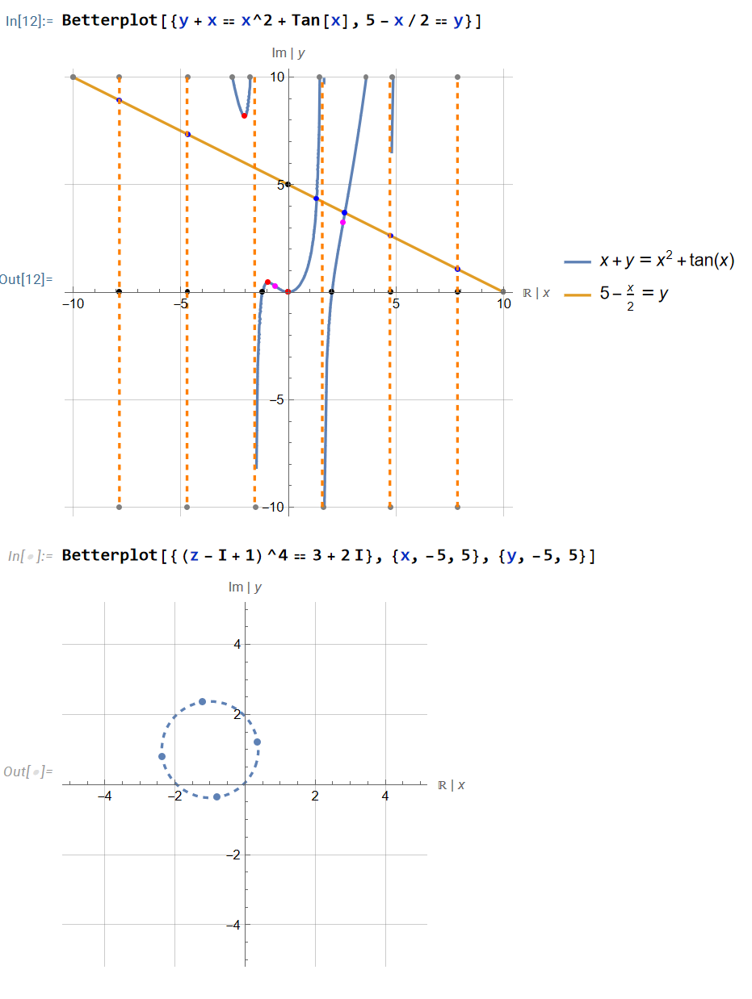

# Better plot
Plot any number of equations with labelled axis, border and graph intercepts, stationary points, inflection points, asymptotes, discontinuity points, endpoints and midpoints. 
Complex equations are also supported

# Bound reference
Custom functions I made to solve VCE Methods, Specialist and University Extension math exams.
