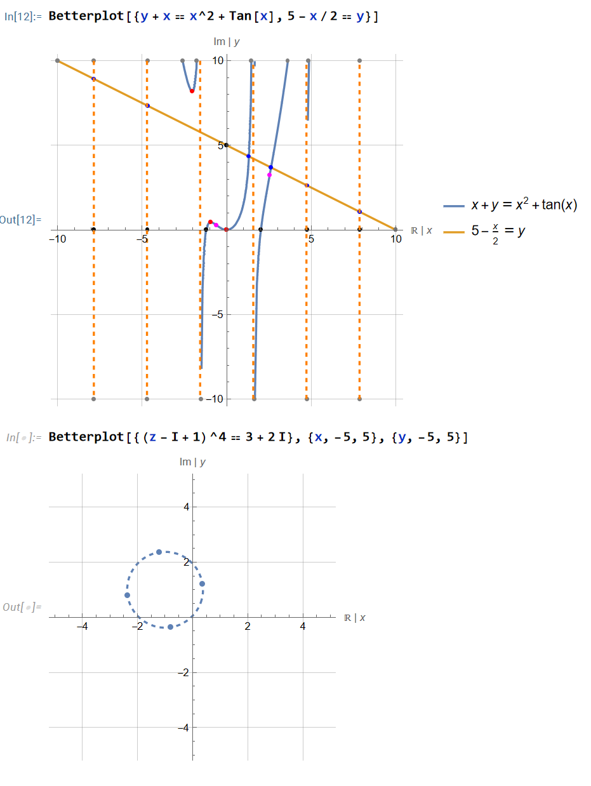

# Bound reference.nb
150+ custom functions I made to solve VCE Methods, Specialist and University Extension math exams.

# Better plot
- Plot any number of equations with labelled axis, border and graph intercepts, stationary points, inflection points, asymptotes, discontinuity points, endpoints and midpoints.</br>
- Complex equations are also supported</br></br>
</br>

# Download
- Download latest Release zip file or download BetterPlot.nb/Bound reference.nb file </br>
- Evaluate all code blocks

# Usage
- Click on a feature/point to print coordinate

**Basic Example** </br>
``` Mathematica
Betterplot[{y == Sin[x]}]
```

**Example with all options:** </br>
``` Mathematica
Betterplot[{y + x == x^2 + Tan[x], 5 - x/2 == y},
"Asymptote" -> True, "N" -> False, "TP" -> True, "Time" -> 7, "IP" -> True, "Endpoints" -> True, PlotPoints -> 50]
```

**Options:**</br>
``` Mathematica
"Asymptote" -> True  (*Show Asymptotes - large impact on speed*)
```
``` Mathematica
"N" -> False (* Calculate features using numeric approximation - use for difficult equations and to increase speed*)
```
``` Mathematica
"TP" -> True  (*Show stationary points (stationary point of inflection/local minima/local maxima) - small impact on speed*)
```
``` Mathematica
"IP" -> True  (*Show Inflection Points (Non stationary) - small impact on speed*)
```
``` Mathematica
"EndPoints" -> True  (*Show endpoints of graph - small impact on speed*)
```
``` Mathematica
PlotPoints -> 50  (*More PlotPoints makes graph less fuzzy at the cost of speed*)
```
``` Mathematica
"Time" -> 7  (*Maximum allowed computation time before forcing abort - Increase for difficult equations*)
```


